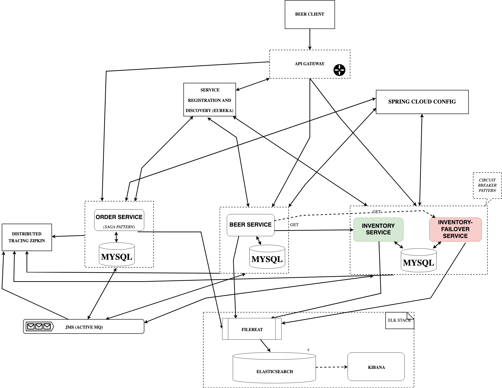

## PROJECT

Project-based on [this course](https://www.udemy.com/course/spring-boot-microservices-with-spring-cloud-beginner-to-guru/) offered on Udemy 
The project was restructured with the new version of spring and new dependencies, because the original course is 3 years old, but still a valid reference.
You can have more info about the content looking the architecture below, I strongly suggest to attend the course with this repo as a reference, due the fact that has major upgrades and fixes, indeed a cleaner structure.

## ARCHITECTURE OVERVIEW

## HOW TO RUN IT

1. Make sure you have docker and docker-compose on your laptop.
2. git clone the project
3. From terminal: cd local-deployment
4. From terminal: docker-compose up
5. Wait few minutes and your project will be up and running.
6. To terminate, from terminal: docker-compose down

## HOW TO RE-BUILD

1. Make sure you have docker and docker-compose on your laptop.
2. git clone the project
3. Go in the project's folder that you would like to re-build.
4. Edit the Dockerfile with your own repo.
5. From terminal: mvn clean package
6. From terminal: mvn docker:build
7. From terminal: mvn docker:push

